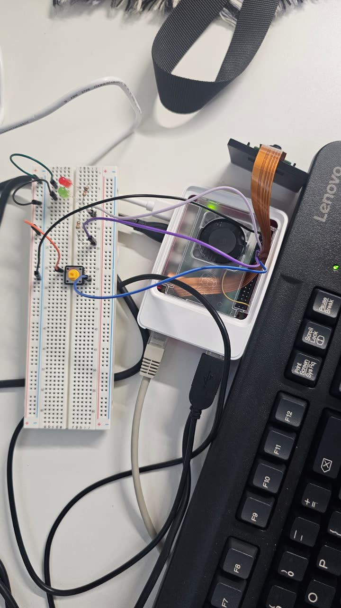
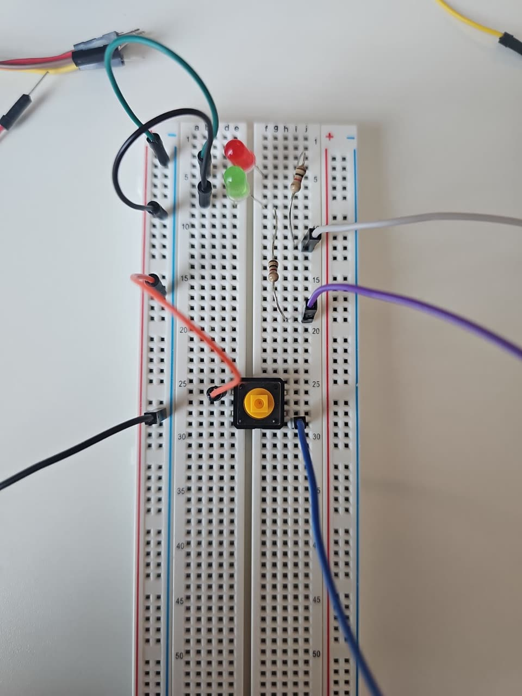
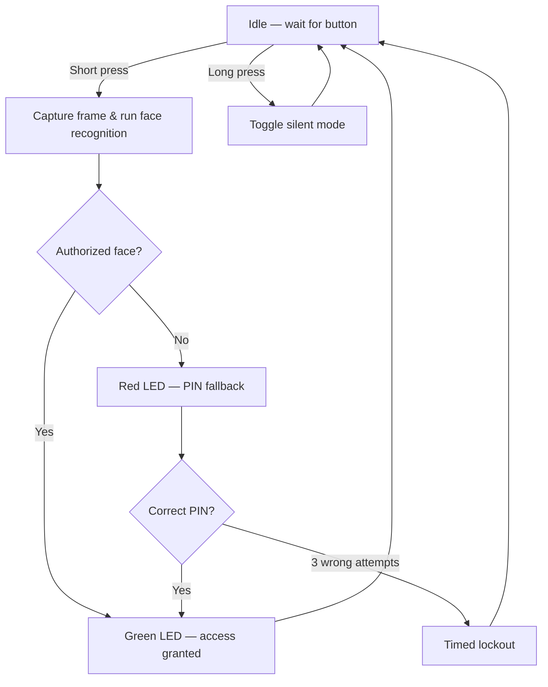

# Smart Access Control System


A face-recognition door entry system running on a Raspberry Pi 5, with a
physical button trigger, LED status feedback, and a 4-digit PIN fallback for
when a face is not recognized.

Built as a **group project** during the STEAM Academy Programme
(Intelligent Systems) at the **University of Wolverhampton**, 19–29 January 2026.
The project received the programme's **Best Group Project Award**.

## Live demo


## Project photos

<table>
<tr>
<td width="50%">



Complete prototype — Raspberry Pi 5, camera, LEDs, and button wired together

</td>
<td width="50%">



Breadboard wiring detail

</td>
</tr>
</table>

---

## How it works

1. The system waits idle until the **push button (GPIO 22)** is pressed — like a doorbell.
2. On a short press, the **camera** captures a frame and runs face recognition
   (retrying once before falling back).
3. If an **authorized face** is matched, the **green LED** turns on for 5 seconds (access granted).
4. If not, the **red LED** turns on and the system asks for a **4-digit PIN**.
5. After **3 wrong PIN attempts**, the system enters a timed **lockout** (15 seconds).
6. A **long button press** toggles **silent mode** — LEDs stay off, for discreet use.
7. Every event is appended to a timestamped **audit log** (`access_log.csv`).



## Hardware architecture

The build runs on a **Raspberry Pi 5** with a **Pi Camera Module** and a small
breadboard circuit: two status LEDs wired through current-limiting resistors,
and a push button using the Pi's internal pull-up.

| Component   | GPIO pin (BCM) |
|-------------|----------------|
| Green LED   | 17             |
| Red LED     | 27             |
| Push button | 22             |

**Parts:** Raspberry Pi 5, Pi Camera Module, green + red LEDs, push button,
breadboard, resistors, jumper wires.

## Tech stack

- **Language:** Python 3
- **Libraries:** `face_recognition`, `opencv-python`, `numpy`, `gpiozero`, `picamera2`

## Security design

- PINs are **never stored in plaintext** — only SHA-256 hashes, compared in
  constant time (`hmac.compare_digest`) to resist timing attacks.
- Real deployments override the demo PINs via environment variables
  (`ACCESS_PIN_SHA256`, `EMERGENCY_PIN_SHA256`) so secrets never enter git.
- Wrong-PIN attempts are limited, with a timed lockout against brute force.
- A cooldown between access attempts prevents rapid retriggering.
- Every event (grants, denials, lockouts, silent-mode toggles) is written to
  a timestamped CSV audit log.

## Setup

```bash
# 1. Install dependencies (on the Raspberry Pi)
pip install -r requirements.txt

# 2. Add face images — one folder per person
#    dataset/<name>/<image>.jpg

# 3. Build the face encodings
python3 create_encodings.py

# 4. Run the system
python3 main.py
```

All tunable settings (GPIO pins, match threshold, lockout duration, unlock
time, …) live in the `Config` dataclass at the top of `main.py`.

## Project files

| File                  | Purpose                                              |
|-----------------------|------------------------------------------------------|
| `main.py`             | Main access-control loop                             |
| `create_encodings.py` | Builds `encodings.pickle` from the `dataset/` folder |
| `requirements.txt`    | Python dependencies                                  |

## Notes & limitations

- Face recognition accuracy depends on lighting and the quality of the
  enrollment photos.
- The demo defaults (PIN `1234` / emergency `0000`) are for testing only —
  override them via the environment variables above for any real use.

---

## Team & roles

This was a collaborative project. Roles as they actually happened:

- **Hardware & integration:** Seif El-Din Tarek — breadboard wiring, camera and
  GPIO integration, and getting the physical build to run reliably with the
  software.
- **Teammates:** Baher, Zeyad, and Hamza — software logic, documentation,
  testing, and presentation.

The code was created with AI assistance (ChatGPT and Claude), then tested and
adapted for the hardware — a normal part of how the team worked.

## Acknowledgements

Thanks to Prof. Ahmed Onsy and the University of Wolverhampton School of
Architecture, Computing and Engineering for the mentorship throughout the
programme.

## License

MIT — see [LICENSE](LICENSE).
